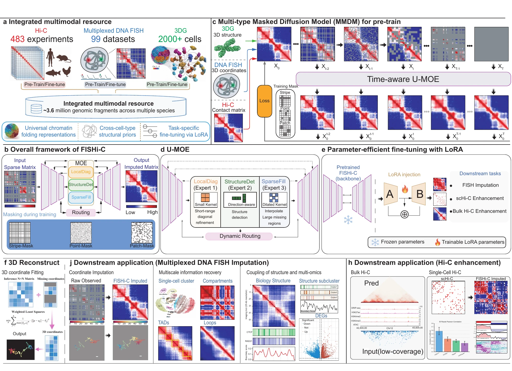

# FISHi-C

**FISHi-C** is a masked diffusion framework for learning transferable chromatin-structure representations from multiplexed DNA FISH, Hi-C, and 3D genome data. A shared pretrained backbone is adapted with parameter-efficient LoRA fine-tuning for three downstream tasks:

- multiplexed DNA FISH imputation and 3D coordinate reconstruction;
- bulk Hi-C enhancement;
- single-cell Hi-C (scHi-C) enhancement.

## Overview



## Contents

- [Installation](#installation)
- [Repository structure](#repository-structure)
- [Quick-start scripts](#quick-start-scripts)
- [1. Data preprocessing](#1-data-preprocessing)
- [2. Pretraining](#2-pretraining)
- [3. FISH imputation](#3-fish-imputation)
- [4. Bulk Hi-C enhancement](#4-bulk-hi-c-enhancement)
- [5. scHi-C enhancement](#5-schi-c-enhancement)

## Installation

Python 3.9 and a CUDA-capable GPU are recommended. The provided environment uses PyTorch 2.4.0 with CUDA 11.8.

```bash
cd FISHi-C

conda create -n fishi-c python=3.9 -y
conda activate fishi-c

pip install -r requirements.txt \
  --extra-index-url https://download.pytorch.org/whl/cu118
```

Verify the installation and GPU availability:

```bash
python -c "import torch; print('PyTorch:', torch.__version__); print('CUDA available:', torch.cuda.is_available())"
```

The training and inference programs automatically select CUDA when it is available. To force CPU execution, append `--device cpu` to a command. CPU execution is supported but can be substantially slower.

## Repository structure

```text
FISHi-C/
├── Data/
│   ├── Pretrain_data/          # FISH matrices used for pretraining
│   ├── FISH_impute_data/       # FISH fine-tuning and imputation data
│   ├── Bulk_enhance_data/      # Paired bulk Hi-C data
│   └── SC_enhance_data/        # Paired single-cell Hi-C data
├── data_process/
│   └── preprocess_fish_data.py
├── generate_mask/              # Utilities for constructing FISH masks
├── models/                     # Network, diffusion, and LoRA modules
├── utils/                      # Dataset loaders and evaluation metrics
├── pretrain.py                 # FISHi-C pretraining
├── finetune_FISH_impute_train.py
├── finetune_FISH_impute_infer.py
├── finetune_enhanced_train.py  # Shared trainer for bulk and scHi-C
├── finetune_enhanced_infer.py  # Shared inference/evaluation program
├── FISH_recon.py               # 3D reconstruction after FISH imputation
├── run_*.sh                    # Bash wrappers for the main workflows
├── LICENSE
├── requirements.txt
└── README.md
```

All commands below are run from the repository root. Relative paths are therefore resolved from `FISHi-C/`.

## Quick-start scripts

The Bash wrappers use the default paths and parameters documented below. Each script first changes to the repository root, so it can be launched from any working directory.

| Workflow | Training | Inference |
| --- | --- | --- |
| Pretraining | `bash run_pretrain.sh` | - |
| FISH imputation | `bash run_finetune_FISH_train.sh` | `bash run_finetune_FISH_infer.sh` |
| Bulk Hi-C enhancement | `bash run_finetune_Bulk_enhanced_train.sh` | `bash run_finetune_Bulk_enhanced_infer.sh` |
| scHi-C enhancement | `bash run_finetune_SC_enhanced_train.sh` | `bash run_finetune_SC_enhanced_infer.sh` |

### Pretraining data

Only the training split is loaded by `pretrain.py`:

```text
Data/Pretrain_data/
└── train/
    └── normalized_distance_matrices.npy
```

### FISH imputation data

Fine-tuning uses complete matrices from `train/`. Inference additionally requires a fixed missing-value mask in `test/`:

```text
Data/FISH_impute_data/
├── train/
│   └── normalized_distance_matrices.npy
├── val/                         # Optional for the current FISH trainer
│   └── normalized_distance_matrices.npy
└── test/
    ├── normalized_distance_matrices.npy
    ├── distance_mask.npy
    ├── masked_coords.npy        # Required only for 3D reconstruction
    └── sigma.npy                # Required only for 3D reconstruction
```

In `distance_mask.npy`, `True` denotes a missing entry and `False` denotes an observed entry. The array shape must match `normalized_distance_matrices.npy`.

### Bulk and single-cell Hi-C enhancement data

Bulk Hi-C and scHi-C use the same paired-data interface:

```text
Data/<Bulk_enhance_data|SC_enhance_data>/
├── train/
│   ├── lr_extra.npy
│   └── hr_extra.npy
├── val/
│   ├── lr_extra.npy
│   └── hr_extra.npy
└── test/
    ├── lr_all.npy
    └── hr_all.npy
```

Here, `lr_*.npy` is the low-quality or unenhanced input and `hr_*.npy` is the enhanced reference. Alternative filenames can be supplied through `--input_filename` and `--label_filename`.

## 1. Data preprocessing

### 1.1 Preprocess multiplexed DNA FISH data

`data_process/preprocess_fish_data.py` converts raw 4DN FISH CSV files into normalized distance-matrix patches. It performs cell filtering, coordinate interpolation, pairwise-distance calculation, min-max normalization, diagonal patch extraction, and an 80/10/10 train/validation/test split.

The input directory must contain `Use_FISH.txt` and the referenced `<4DN_ID>.csv` files. Records labeled `Pre-train` in `Use_FISH.txt` are selected.

```bash
python data_process/preprocess_fish_data.py \
  --input-dir /path/to/raw_fish \
  --output-dir /path/to/processed_fish \
  --use-fish-file /path/to/raw_fish/Use_FISH.txt \
  --patch-size 64 \
  --missing-rate 0.10 \
  --seed 42
```

Add `--download` if missing CSV files should be downloaded from the 4DN data portal.

The preprocessing program writes `train/train_data.npy`, `val/val_data.npy`, and `test/test_data.npy`. Before training, place or rename the generated arrays to the loader-facing names shown below:

```text
Data/Pretrain_data/
├── train/normalized_distance_matrices.npy
├── val/normalized_distance_matrices.npy
└── test/normalized_distance_matrices.npy
```

Only `train/normalized_distance_matrices.npy` is required by the current pretraining program.

### 1.2 Generate fixed masks for FISH evaluation

The utilities in `generate_mask/` create row/column masks and split downstream FISH arrays. The mask convention is:

- `True`: missing/masked;
- `False`: observed.

`generate_mask/mask_step1.py` currently uses configuration variables inside the file. Set its source `data_path` and output path, then run:

```bash
python generate_mask/mask_step1.py
python generate_mask/mask_step2_spilt.py
```

Move the resulting split directories under `Data/FISH_impute_data/` and retain at least the files listed in [FISH imputation data](#fish-imputation-data). The spelling `mask_step2_spilt.py` is the current repository filename.

### 1.3 Prepare paired Hi-C data

The repository expects preprocessed paired NumPy arrays for bulk and single-cell Hi-C. Normalize the input and reference matrices consistently, confirm that each input/target pair has the same shape, and store the arrays using the layout in [Bulk and single-cell Hi-C enhancement data](#bulk-and-single-cell-hi-c-enhancement-data).

## 2. Pretraining

Pretraining learns a general chromatin-structure reconstruction prior from complete normalized FISH distance matrices. During optimization, the diffusion module creates synthetic band or patch masks and learns to recover the original matrix.

```bash
python pretrain.py \
  --data_path ./Data/Pretrain_data \
  --output_dir ./pretrain_model \
  --batch_size 32 \
  --num_epochs 80 \
  --lr 1e-4 \
  --model_type unet \
  --base_channels 64 \
  --timesteps 1000 \
  --mask_strategy band \
  --loss_type l1+ssim \
  --save_interval 5
```

Important outputs:

```text
pretrain_model/
├── config.json
├── best_model.pt
├── checkpoint_epoch_<N>.pt
└── training_history.json
```

Use `pretrain_model/best_model.pt` as the initialization checkpoint for all downstream tasks.

## 3. FISH imputation

### 3.1 LoRA fine-tuning

The FISH trainer injects LoRA modules into the pretrained backbone. Complete training matrices are corrupted online with random row/column masks, and the model learns a supervised masked-to-complete reconstruction mapping.

```bash
python finetune_FISH_impute_train.py \
  --data_path ./Data/FISH_impute_data \
  --pretrained_checkpoint ./pretrain_model/best_model.pt \
  --output_dir ./output_finetune_FISHImpute \
  --batch_size 16 \
  --num_epochs 20 \
  --lr 1e-4 \
  --min_mask_ratio 0.2 \
  --max_mask_ratio 0.8 \
  --observed_loss_weight 0.1 \
  --lambda_ssim 1.0 \
  --lambda_std 0.1 \
  --lora_rank 8 \
  --lora_alpha 16 \
  --lora_dropout 0.0 \
  --save_interval 5
```

The best checkpoint is saved as:

```text
output_finetune_FISHImpute/best_finetuned.pt
```

Append `--multi_gpu` to use all visible GPUs through PyTorch `DataParallel`.

### 3.2 Imputation and evaluation

Inference uses `test/normalized_distance_matrices.npy` and the fixed `test/distance_mask.npy`.

```bash
python finetune_FISH_impute_infer.py \
  --checkpoint ./output_finetune_FISHImpute/best_finetuned.pt \
  --data_path ./Data/FISH_impute_data \
  --output_dir ./Result_FISH_impute \
  --batch_size 16 \
  --num_vis 10
```

Add `--quiet` to disable the progress bar in batch jobs. Outputs include:

```text
Result_FISH_impute/
├── true_matrices.npy
├── pred_finetuned.npy
├── masks.npy
├── masked_input.npy
├── metrics_finetuned.json
└── visualizations/
```

### 3.3 Reconstruct 3D coordinates

`FISH_recon.py` converts imputed contact-style matrices back to distances with the per-sample `sigma`, then estimates missing 3D coordinates by weighted least squares.

The current script resolves the following inputs relative to the working directory:

```text
pred_finetuned.npy
test/sigma.npy
test/masked_coords.npy
```

Place the inference result and reconstruction metadata at those locations, or update the three `np.load(...)` paths in `FISH_recon.py`, then run:

```bash
python FISH_recon.py
```

The script writes:

```text
recon_coord.npy
recon_distance_matrix.npy
```

## 4. Bulk Hi-C enhancement

Bulk Hi-C enhancement fine-tunes the pretrained FISHi-C backbone on paired low-quality and enhanced matrices.

### 4.1 Fine-tuning

```bash
python finetune_enhanced_train.py \
  --data_path ./Data/Bulk_enhance_data \
  --pretrained_checkpoint ./pretrain_model/best_model.pt \
  --output_dir ./output_finetune_enhanced_bulk_hic \
  --input_filename lr_extra.npy \
  --label_filename hr_extra.npy \
  --batch_size 32 \
  --num_epochs 20 \
  --lr 1e-4 \
  --lambda_l1 1.0 \
  --lambda_l2 1.0 \
  --lambda_ssim 0.5 \
  --lora_rank 8 \
  --lora_alpha 16 \
  --lora_dropout 0.0 \
  --save_interval 5
```

The best checkpoint is saved to `output_finetune_enhanced_bulk_hic/best_finetuned_enhanced.pt`. Append `--no_lora` to fine-tune all model parameters, or `--multi_gpu` to enable `DataParallel`.

### 4.2 Inference and evaluation

```bash
python finetune_enhanced_infer.py \
  --checkpoint ./output_finetune_enhanced_bulk_hic/best_finetuned_enhanced.pt \
  --data_path ./Data/Bulk_enhance_data \
  --output_dir ./Result_finetune_enhanced_bulk_hic \
  --input_filename lr_all.npy \
  --label_filename hr_all.npy \
  --split test \
  --batch_size 32 \
  --num_vis 30 \
  --viz_format pdf \
  --viz_clip_percentile 90
```

## 5. scHi-C enhancement

scHi-C enhancement uses the same trainer and inference program as bulk Hi-C, with a separate dataset and output directory.

### 5.1 Fine-tuning

```bash
python finetune_enhanced_train.py \
  --data_path ./Data/SC_enhance_data \
  --pretrained_checkpoint ./pretrain_model/best_model.pt \
  --output_dir ./output_finetune_enhanced_sc_hic \
  --input_filename lr_extra.npy \
  --label_filename hr_extra.npy \
  --batch_size 32 \
  --num_epochs 20 \
  --lr 1e-4 \
  --lambda_l1 1.0 \
  --lambda_l2 1.0 \
  --lambda_ssim 0.5 \
  --lora_rank 8 \
  --lora_alpha 16 \
  --lora_dropout 0.0 \
  --save_interval 5
```

### 5.2 Inference and evaluation

```bash
python finetune_enhanced_infer.py \
  --checkpoint ./output_finetune_enhanced_sc_hic/best_finetuned_enhanced.pt \
  --data_path ./Data/SC_enhance_data \
  --output_dir ./Result_finetune_enhanced_sc_hic \
  --input_filename lr_all.npy \
  --label_filename hr_all.npy \
  --split test \
  --batch_size 32 \
  --num_vis 30 \
  --viz_format pdf \
  --viz_clip_percentile 90
```

For both enhancement tasks, inference writes:

```text
<output_dir>/
├── input_matrices.npy
├── pred_enhanced.npy
├── label_enhanced.npy
├── metrics_enhanced.json
└── visualizations/
```